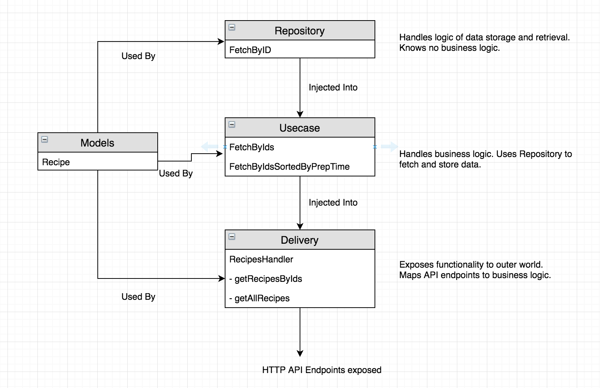

Reverse Proxy aggregartion API for data stored at S3
=========


Given
-----

You are given an external API endpoint which allows to query recipe information. Each recipe can be accessed by an `integer` id.
The recipe id enumeration starts from `1`.

Example HTTP calls

```
curl -X GET https://replaceme.com/1
curl -X GET https://replaceme.com/2
```

Task
----

Design an application which would act as a reverse proxy and expose the _aggregated recipes_ from the external API over HTTP.

#### Requirements

- The recipes in the aggregated list **must** contain the same data as the original recipes. Data modifications are **not allowed**.
- The endpoint response **must** be `JSON` encoded.
- The endpoint response time **must** be lower than `1s`.
- The application should be stateless, i.e. it is **not allowed** to cache the recipe response on the application side.
- The endpoint **should not** render all the recipes in a single response. It is **allowed** to make [use of pagination](http://docs.oasis-open.org/odata/odata/v4.01/cs01/part2-url-conventions/odata-v4.01-cs01-part2-url-conventions.html#_Toc505773300).

##### Use Case #1 - all recipes

A user should be able to retrieve an aggregated list of **all the recipes** from the source API.

_Specific requirements_
- The endpoint **must** provide access to ALL available recipes.
- The order for the rendered recipes **is irrelevant**
- The solution should operate under the assumption that the source API contains an unlimited number of recipes.

> `All available recipes` are the recipes with the `id` lower than the `id` with the first `404 Not Found` HTTP response status code.
>
> For example, if
>  `curl -X GET https://replaceme.com/99999` returns HTTP status code `200 OK`
> and
> `curl -X GET https://replaceme.com/100000` returns HTTP status code `404 Not Found`
> then
> `all available recipes` are the ones with the `ids` from 1 to 99999


Example endoint: `GET http://myservice.io/recipes`

```json
[
    {
        "id": "5",
        // ...
    },
    {
        "id": "1",
        // ...
    },
    {
        "id": "2",
        // ...
    }
]
```

##### Use Case #2 - recipes by `id`

A user should be able to retrieve a list of **aggregated recipes** from the source API by a given `id`.

_Specific requirements_

- The endpoint **must** provide access to the recipes by the provided `id`.
- The recipes should be ordered by `prepTime` from lowest to highest.

Example endpoint and response: `GET http://myservice.io/recipes?ids=1,2,5`

```json
[
    {
        "id": "1",
        "prepTime": "PT30",
        // ...
    },
    {
        "id": "5",
        "prepTime": "PT30",
        // ...
    },
    {
        "id": "2",
        "prepTime": "PT35",
        // ...
    }
]
```


Solution
----

#### Endpoint 1 GET "http://localhost:8080/recipes"
- Provides access to ALL available recipes
- Uses paging. Sample : "http://localhost:8080/recipes?$skip=10&$top=5"
- By default, uses values skip=0 top=10. Hence "http://localhost:8080/recipes" returns first ten records.
- Starts go routines to fetch the recipes concurrently.
- Uses channels to combine response and return back to user.
- Uses 10 goroutines by default to process response in less than 1 sec, but no hard limit set on value of top.
- Returns error response if even 1 GET call to fetch recipe from S3 fails with status code other than 404. Uses timeout of 1 sec in the call to S3.

#### Endpoint 2 GET "http://localhost:8080/recipes?ids="
- Provides access to all available recipes by id
- Doesn't use paging.
- Sorts the recipes in response based on PrepTime values.
- Starts n go routines to fetch n recipes concurrently. n is the number of ids passed as query parameter.
- Uses channels to combine response and return back to user.
- Returns error response if even 1 GET call to fetch recipe from S3 fails with status code other than 404. Uses timeout of 1 sec in the call to S3.

Architecture/ Code structure
----

The code structure for the project has it's motivation in Uncle Bob's Clean Architecture.

#### It tries to follow the following principles
- Independence from Frameworks - The architecture does not depend on the existence of some library. Databases/UI frameworks can be swapped easily. Business logic is independent of DB or style of exposure.
- Separation of concerns - Layers of architecture should be such that business concerns, delivery concerns and storage concerns are not intermixed.
- Individual Testable components - The business logic can be tested separately.

#### 4 layered architecture
- Models - Stores the structures of data. Can be utilized in any layer.
- Repository - This layer is responsible for CRUD operations, whether from DB or another service. No business logic.
- Usecase - This layer will act as the business process handler. It decides and uses Repository layer accordingly.
- Delivery - This acts as the presenter to the outer world. Contacts Usecase layer to respond to API calls.



Details
----

#### Steps to run

- docker-compose up